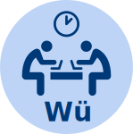

# About
Come to talk about science in a social environment.
If you want to know how computational tools and code can improve your science or you just want to drink a beer: join us.

# When and Where
Every fourth Thursday of the month at 5 pm at the [CCTB Würzburg](https://www.google.de/maps/place/Center+for+Computational+and+Theoretical+Biology+%28CCTB%29,+University+of+W%C3%BCrzburg/@49.7851224,9.9708763,17z/data=!3m1!4b1!4m2!3m1!1s0x47a28fc802e5e8d9:0x6b62d2cbd2e6f094).
You can come without registration but feel free to join the discussion in the linked pad (see table below) if you have any questions beforehand.
Usually we order pizza and sit together until roughly 8pm.

### Attention
Next HackyHour would be the 25th of May which is a holiday.
So please add your vote [here](https://github.com/HackyHour/Wuerzburg/issues/32) for an alternative date this month.

# Topics
In addition to the open discussions we also aim to talk about specific topics at each HackyHour.
However prior knowledge or interest in these topics is not a prerequisite.
Online discussions for these topics are accessible via the following links.

| Date       | Summary      | Discussion |
| ---------- |--------------| ----------:|
| 2017-05-?? | Join the discussion | [#32](https://github.com/HackyHour/Wuerzburg/issues/32) |
| 2017-04-27 | Monte Carlo Simulations | [#31](https://github.com/HackyHour/Wuerzburg/issues/31) |
| 2017-03-23 | Website re-design ideas, React | [#29](https://github.com/HackyHour/Wuerzburg/issues/29) |
| 2017-02-23 | Docker, Random Forest Cross Validation | [#28](https://github.com/HackyHour/Wuerzburg/issues/28) |
| 2017-01-26 | Random Forest, Bioinformatics Contest 2017 | [#27](https://github.com/HackyHour/Wuerzburg/issues/27) |
| 2016-12-22 | Penetration testing (metasploitable) | [#26](https://github.com/HackyHour/Wuerzburg/issues/26) |
| 2016-10-27 | Kaggle (Titanic) | [#24](https://github.com/HackyHour/Wuerzburg/issues/24) |
| 2016-09-30 | Julia, Regex Golf | [#23](https://github.com/HackyHour/Wuerzburg/issues/23) |
| 2016-07-29 | Nextcloud on Raspberry Pi, Logo | [#22](https://github.com/HackyHour/Wuerzburg/issues/22) |
| 2016-06-30 | Publishing tools: Latex vs Word, Illustrator vs Inkscape, Endnote vs Bibtex/Mendeley/... | [#20](https://github.com/HackyHour/Wuerzburg/issues/20) |
| 2016-06-02 | PID-controller, more codingames | [#18](https://github.com/HackyHour/Wuerzburg/issues/18) |
| 2016-05-04 | Coding Dojo with codingame.com | [#16](https://github.com/HackyHour/Wuerzburg/issues/16) |
| 2016-03-30 | Internet security, https, encryption, pgp, P/NP problems | [#15](https://github.com/HackyHour/Wuerzburg/issues/15) |
| 2016-02-24 | Webcam on Raspberry Pi, zfs and raids | [#14](https://github.com/HackyHour/Wuerzburg/issues/14) |
| 2016-01-27 | Raspberry Pi, OwnCloud, Perl vs R | [#12](https://github.com/HackyHour/Wuerzburg/issues/12) |
| 2015-11-25 | Misc | [#11](https://github.com/HackyHour/Wuerzburg/issues/11) |
| 2015-10-28 | Website, GitHub | [#10](https://github.com/HackyHour/Wuerzburg/issues/10) |
| 2015-09-22 | Organizational | [#9](https://github.com/HackyHour/Wuerzburg/issues/9) |

# Inspiration
This project is inspired by [HACKYHOUR@AUCKLAND](https://uoa-eresearch.github.io/HackyHour/) and the [R Study Group](http://minisciencegirl.github.io/studyGroup/).
If you are interested in the HackyHour you should also check out [WUBSyB](http://wubsyb.github.io/)

# Logo
The logo is derived from the one used by HackyHour Auckland (with kind permission).
It uses a public domain <a href="https://thenounproject.com/search/?q=hackathon&i=6324">icon</a> 
and the open <a href="https://fontlibrary.org/en/font/jellee-typeface">Jelle</a> font (SIL Open Font License).
Colors are the corporate design colors from the University of Würzburg.

# License
The content of this website is available under [CC0](LICENSE).
This website uses the [hacker template](https://github.com/pages-themes/hacker/) which is also available under [CC0](https://creativecommons.org/publicdomain/zero/1.0/legalcode).
